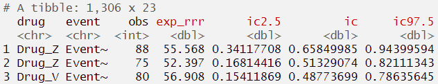

# Introduction
```{r, include=FALSE}
library(pvda)
knitr::opts_chunk$set(echo = FALSE)
```

During the life cycle of a medicinal product, knowledge of the safety profile 
continues to accumulate post market introduction. Adverse event reports 
collected through spontaneous reporting play an instrumental part in this 
development.

Adverse event report databases often cover a wide range of drugs 
and events, beyond what can be feasibly monitored through manual work. 
Disproportionality analysis is thus often used to highlight drug-event-combinations 
of potential interest for further qualitative manual case-by-case assessment. 

The `pvda` package provides three disproportionality estimators: 
the proportional reporting rate (PRR), the reporting odds ratio (ROR) 
and the information component (IC). It takes report level data as input, and
outputs estimates for each drug-event-combination, possibly stratified by some
variable of interest, e.g. age group and/or sex. 

# Running a disproportionality analysis
The workhorse of this package is the function `da`. The `da`-function takes 
patient level data in a data frame as input (here `drug_event_df`) and produces 
estimates and summary counts as demonstrated below.

```{r}
#| echo = TRUE 

da_1 <- 
  drug_event_df |>
  da()
```

The `drug_event_df` is a simulated data set with drugs named Drug_A - Drug_Z 
and events Event_1 - Event_1000. Further details about the simulation are 
documented in the data object (execute `?df_drug_event`).

## Specifying the column names

The da-function will examine the passed data set for column names contained in
the passed parameter list "df_colnames". The default column names are "report_id", "drug" and "event". If we rename the report-id column in "drug_event_df" we need to specify the new name in the call to da, as shown below:

```{r}
#| echo = TRUE 

da_1 <-
  drug_event_df |> 
  dplyr::rename(reportID = report_id) |> 
  da(df_colnames = list(report_id = "reportID"))
```

## Summarizing and printing results

The 'da_1' object can then be passed to a summary and a print function.

```{r, echo = TRUE, results = FALSE, message = FALSE}
summary(da_1)
```

{width=110%}

```{r, echo = TRUE, results = FALSE, message = FALSE}
print(da_1, n=3)
```

{width=110%}

(Technical note: As printing of colors in the console is not easily reproduced within this vignette , we provide screenshots when applicable. )

## Passing a correctly structured input data
The input data needs to be in a report-level format. every line in the data 
frame corresponds to a drug-event pair from a specific report.

In the drug_event_df-example data, the first three rows of drug_event_df are 
from the same report, with report_id = 1. The first row reports a Drug_D and 
an adverse event named Event_5.The next three rows are from another report, 
where for instance drug B has been reported for two different events, event 15 
and event 33. We can ignore the group-column for now.

```{r}
#| echo = TRUE 
drug_event_df[1:6, ]
```

## Extracting the results
For covenience, the output object of da is a list of class "da" containing
two objects, the results ("da_df") and the input parameters ("input_params"). 
At some point you might want to extract the results or the input parameters list, 
here we demonstrate some alternatives: 

```{r}
#| echo = TRUE 
names(da_1)

# Different ways of extracting the results data frame
# da_1$da_df
# da_1[['da_df']]
# da_1 |> purrr::pluck("da_df")

```

## How to run a subgroup analysis?
The `da` function builds a comparator from the passed data, e.g. for `prr` by
excluding the drug of interest from the comparator, sometimes referred to as the 
background. This implies that any subgroup analysis of e.g. specific age groups 
can be achieved by creating a new data frame with the subgroup of interest, 
and then passing it to `da`.  

If a more exhaustive grouping is required, one can provide a grouping variable 
`group_by` to `da`. This executes a call to `da` for each grouping and 
return the results as a single data frame. The grouping could for instance 
be age groups, sex, countries, regions or a combination thereof, but needs to 
be passed as a single variable (character or numeric). 

The drug_event_df contains two groups, in the column named "group". We can pass
"group" as the `group_by` parameter in `df_colnames` as below.

```{r}
#| echo = TRUE

drug_event_df |> 
  head()

da_grouped <- 
  drug_event_df |> 
  da(df_colnames = list(group_by="group")) 

print(da_grouped$da_df)

```

In the output we note the third column is "group", i.e. the column name we passed.
We also note that the drug-event-pairs are kept together, e.g. first and second row
contains the same drug-event-combination, "Drug_Z" and "Event_1". This is to 
simplify comparisons within a drug-event-pair across different groups, e.g. if
the same pattern is seen across both males and females. The ordering of 
the drug-events in the output is made by averaging the selected disproportionality 
estimate (parameter `sort_by`), i.e. the top two rows have the highest
average "ic2.5". 

# Frequently Asked Questions

## How are drug-event pairs occurrings several times in one report counted?
If the same drug-event pair occurs several times in one report, these contributes 
to counts only once. That is, an observed count of five means that there were 
five different reports containing the drug-event-pair (at least once). It cannot
be due to a single report containing the same drug-event pair five times due 
to repeated events or data quality issues. This is demonstrated below, where we 
duplicate the first row of drug_event_df and still arrive at an observed count of 1.

```{r}
#| echo = TRUE 
first_row <- drug_event_df[1,]

first_row |> 
  dplyr::bind_rows(first_row) |> 
  da() |> 
  purrr::pluck("da_df") |> 
  dplyr::pull(obs)

```

## How is the expected calculated?
Detailed formulas for PRR, RRR and IC are documented within each function (
"?prr", "?rrr", "?ic"), but overall one can note that all expected counts are 
derived from the same contingency table of those who were and were not exposed 
to the drug, and did and did not experience the adverse event. The sample
used for the contingency table is the data frame passed to the da function. See
also the grouping parameter.

## Where is exp_ic in the output, or what is exp_prr?
A common question regards the output column names, ic is preceded by "exp_prr". 
This is as the information component uses the same expected count as the 
Relative Reporting Rate (RRR), which is perhaps more well known in the 
pharmacovigilande community.

```{r}
#| echo = TRUE 

# Note the fourth column name:
drug_event_df |> 
  da() |> 
  purrr::pluck("da_df") |> 
  dplyr::select(drug:ic97.5) |> 
  print(n=1)

```

## Rule of N
The function `da` has several input parameters. One is the `rule_of_N`, by default set to 3, 
which is sometimes referred to as "rule of three". This sets ROR and PRR-values 
to NA if the observed count is less than the specified N. For completeness, note that the default shrinkage 
in the IC acts as a built in 'rule of 3', (i.e. the shrinkage of +0.5 prevents 
the lower bound to exceed 0 at the default significance level of 95\%).

## Controlling the number of digits
The function `da` has a parameter `number_of_digits` controls the rounding of non-count values in the output, including all expected counts, uncertainty bounds and point estimates.

```{r, echo = TRUE, results = FALSE, message = FALSE}
#| warning = FALSE

drug_event_df |>
  da(
    rule_of_N = 3,
    number_of_digits = 8
  ) |> print(n = 3)
```



## Can I use pvda to get IC, PRR or ROR, when I already have the observed and expected counts? 
Yes, you can calculate point estimates with confidence or credibility intervals 
for specific drug-event-combination if you already have the number of observed 
reports, and other required counts such as the database total count, number of reports 
with the exposure and number of reports with the event. This can be helpful
for instance to quality check results, e.g. from papers or other software.

```{r}
#| echo = TRUE
prr(obs = 10, n_drug = 1000, n_event_prr = 200, n_tot_prr = 10000)
ror(a = 10, b = 20, c = 200, d = 10000)
ic(obs = 10, exp = 5)
```

For further details on the specific input parameters, consult the documentation 
of each function. 

## How fast is pvda?
The data.table-package (through "dtplyr") is used for fast execution. A test of 
the execution speed was made using the `vaers` R package, available on 
[gitlab](https://gitlab.com/iembry/vaers.git). The `vaers` package contains 
data from VAERS from years 1990 - 2018, resulting in 4 146 778 rows to
be processed by `da` in `pvda`. Execution time on a regular laptop was less 
than 10 seconds.

```{r, include=FALSE}
# plot_udfs_as_graph <- function(package_name = "pvda"){

# library(pvda)
# package_name <- "pvda"
# ns_names <- getNamespaceExports(package_name)
# ns_names_w_id <- dplyr::bind_cols("id" = seq_along(ns_names), "name" = ns_names)
# edge_output <- list()
#
# for (i in seq_along(ns_names)) {
#   # i = 9
#
#   ns_name_i <- ns_names[i]
#   code_function_i <- body(get(ns_name_i)) |> paste0((as.character()), collapse = "")
#
#   # Find first occurrence of prefix calls in code_function_i
#   ns_calls <- stringr::str_c(ns_names, "(")
#   # ns_calls_with_comma <- stringr::str_c("", ns_names, "(")
#   # Avoid "is.numeric" being counted as ic
#   code_function_i <- gsub(x = code_function_i, pattern = "as.numeric", replacement = "", fixed = T)
#   # str_replace didn't manage this.
#
#   first_call_pos <- stringr::str_locate(
#     stringr::fixed(code_function_i),
#     stringr::fixed(c(ns_calls))
#   )[, 1]
#
#   calls <- na.omit(dplyr::bind_rows(
#     "function_id" = ns_names_w_id$id,
#     "function_name" = ns_names_w_id$name,
#     "pos" = first_call_pos
#   )) |>
#     dplyr::arrange(pos) |>
#     dplyr::select(-pos) |>
#     dplyr::filter(!function_name %in% c("custom_colours", "custom_ggtheme", "sign_lvl_to_quantile_prob"))
#
#   edges <- dplyr::bind_cols(i, calls) |>
#     dplyr::select(-function_name)
#   colnames(edges) <- c("from", "to")
#   edges <- edges |>
#     dplyr::filter(from != to)
#   edge_output[[i]] <- edges
# }
#
# edges <- do.call(rbind.data.frame, edge_output)
# edge_df <- DiagrammeR::create_edge_df(edges$from, edges$to)
#
# nodes_with_edges <- c(unique(edges$from), unique(edges$to))
#
# nodes <- dplyr::bind_cols(
#   "id" = 1:length(ns_names),
#   "label" = ns_names
# )[1:length(ns_names) %in% nodes_with_edges, ]
# node_df <- DiagrammeR::create_node_df(length(nodes$id),
#   label = nodes$label,
#   fontsize = 6,
#   shape = "rectangle",
#   fixedsize = FALSE
# )
#
# node_df$id <- nodes$id
#
#
# graph <- DiagrammeR::create_graph(
#   nodes_df = node_df,
#   edges_df = edge_df
# )
#
# suppressWarnings(DiagrammeR::render_graph(graph,
#   layout = "tree",
#   title = "Overview of package functions"
# ))
```

```{r, echo=FALSE, fig.height = 8, fig.width = 8}
# suppressWarnings(DiagrammeR::render_graph(graph,
#   layout = "tree",
#   title = "Overview of package functions"
# ))
```
